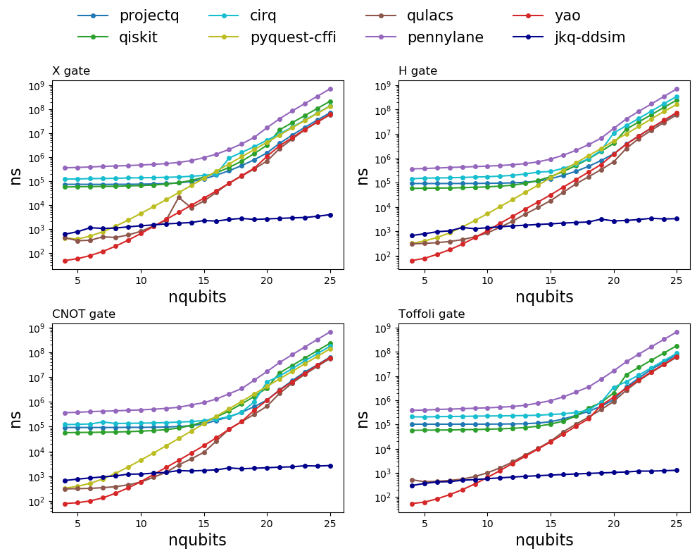
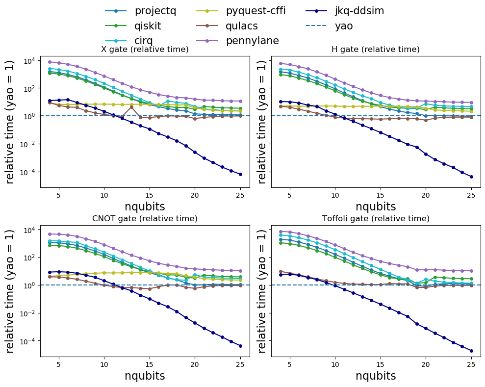
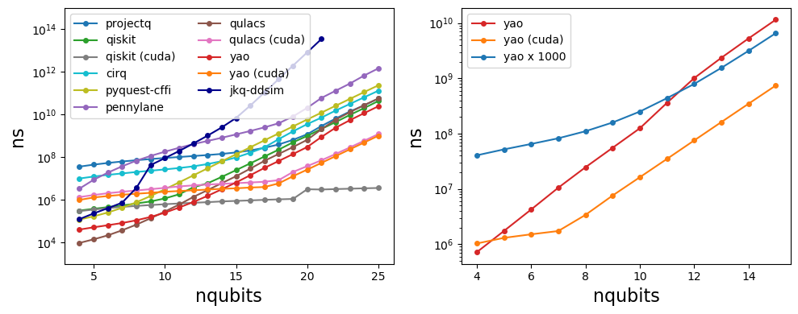
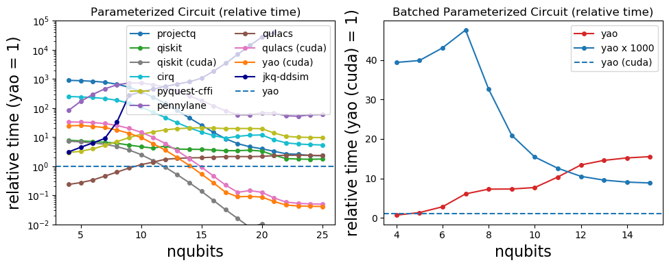

# Benchmark Results

- [Benchmark Results](#benchmark-results)
  - [Single Thread Benchmark](#single-thread-benchmark)
    - [Machine Info](#machine-info)
    - [Package Info](#package-info)
    - [Single Gate Benchmark](#single-gate-benchmark)
    - [Parameterized Circuit Benchmark](#parameterized-circuit-benchmark)
    - [Batched parameterized circuit of Yao and CuYao](#batched-parameterized-circuit-of-yao-and-cuyao)

## Single Thread Benchmark

This benchmark only include single thread benchmark, all the multithread features are disabled.

### Machine Info

Julia & CPU Info

```
julia> versioninfo()
Julia Version 1.3.0
Commit 46ce4d7933 (2019-11-26 06:09 UTC)
Platform Info:
  OS: Linux (x86_64-pc-linux-gnu)
  CPU: Intel(R) Xeon(R) Gold 6230 CPU @ 2.10GHz
  WORD_SIZE: 64
  LIBM: libopenlibm
  LLVM: libLLVM-6.0.1 (ORCJIT, skylake)
```

BLAS: intel MKL

Python version: 3.7.3

GPU: Tesla V100

### Package Info

|       Package        | Version | Type of Simulator |
| -------------------- | ------- | ----------------- |
| Yao                  | v0.6.1  | full amplitudes   |
| CuYao                | v0.2.0  | full amplitudes   |
| qiskit               | 0.16.0  | full amplitudes   |
| qiskit-aer           | 0.4.0   | full amplitudes   |
| qiskit-terra         | 0.12.0  | full amplitudes   |
| qulacs               | 0.1.9   | full amplitudes   |
| projectq             | 0.4.2   | full amplitudes   |
| Cirq                 | 0.7.0   | full amplitudes   |
| PennyLane            | 0.8.1   | full amplitudes   |
| QuEST (pyquest-cffi) | 0.1.1   | full amplitudes   |
| JKQ DDSIM¹           | v1.1    | decision diagrams |

¹ This benchmark uses the mean estimator for the timings. To get accurate timings when recreating the results, please ensure no other other applications run concurrently.

### Single Gate Benchmark

Benchmarks of a) Pauli-X gate; b) Hadamard gate; c) CNOT gate; d) Toffolli gate.





### Parameterized Circuit Benchmark

b) Benchmarks of parameterized circuit. c) Benchmarks of parametrized circuit with batched registers (batch size = 1000).

NOTE: 

- qiskit state vector simulator does not support rotation x/z gate, thus there is no benchmark on the following circuits.
- PennyLane benchmark contains some overhead from error handling since we do not include measurement in this benchmark (https://github.com/Roger-luo/quantum-benchmarks/pull/7)
- the performance of CUDA may vary on different machine (https://github.com/Roger-luo/quantum-benchmarks/issues/6), although the difference is not very huge




